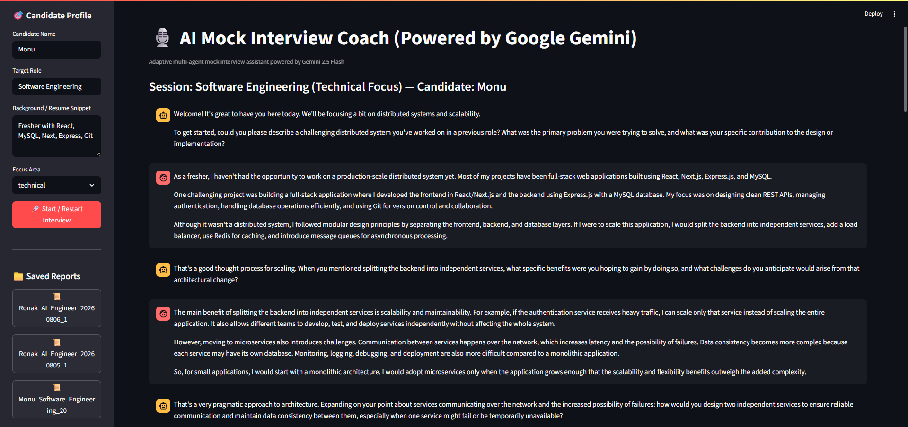

# 🎙️ AI Mock Interview Coach

An intelligent AI-powered mock interview platform that simulates real technical interviews using Google's Gemini API. The application adapts follow-up questions based on candidate responses and generates personalized feedback to help users improve their interview performance.

Built with **Python**, **Google Gemini 2.5 Flash**, and **Streamlit**.

---

## 🚀 Features

- 🤖 AI-powered mock interviews
- 🎯 Role-based interview sessions
- 🔄 Adaptive follow-up questions
- 📊 Intelligent response evaluation
- 📝 Personalized interview feedback
- 🌐 Interactive Streamlit web interface
- ⚡ Fast response generation with Gemini API

---

# 🏗️ System Architecture

```
                Candidate
                    │
                    ▼
        ┌─────────────────────┐
        │   Streamlit UI      │
        └──────────┬──────────┘
                   │
                   ▼
      ┌──────────────────────────┐
      │   Interview Orchestrator │
      └───────┬─────────┬────────┘
              │         │
              ▼         ▼
      Interviewer    Evaluator
          Agent         Agent
              │         │
              └────┬────┘
                   ▼
             Coach Agent
                   │
                   ▼
          Final Feedback Report
```

---

# 🤖 Agent Responsibilities

## 1. Interviewer Agent

Responsible for conducting the interview by asking realistic technical and behavioral questions.

**Responsibilities**

- Generates interview questions
- Adapts follow-up questions
- Increases or decreases difficulty
- Maintains interview flow

---

## 2. Evaluator Agent

Analyzes every candidate response during the interview.

**Evaluates**

- Technical Accuracy
- Communication
- Problem Solving
- Role Relevance

Provides structured scores that guide the next interview question.

---

## 3. Coach Agent

Generates the final interview report after the interview ends.

The report includes:

- Overall performance
- Strengths
- Weaknesses
- Improvement suggestions
- Preparation roadmap

---

# 🛠️ Tech Stack

| Category | Technology |
|-----------|------------|
| Language | Python |
| LLM | Google Gemini 2.5 Flash |
| Framework | Streamlit |
| Configuration | python-dotenv |
| Validation | Pydantic |
| AI Integration | Google Generative AI SDK |

---

# 📂 Project Structure

```text
AI_Interview_Coach/
├── .env.example                          # Environment variables template
├── .gitignore                            # Standard Python & Streamlit gitignore
├── README.md                             # Complete setup and architecture documentation
├── requirements.txt                      # Python package dependencies
├── config.py                             # Centralized configuration setup
├── app.py                                # Streamlit Web Application entry point
├── prompts/                              # Dedicated prompt definitions
│   ├── interviewer_agent.txt             # Conversational & adaptive prompt for Interviewer
│   ├── evaluator_agent.txt               # Structured evaluation prompt for Evaluator
│   └── coach_agent.txt                   # Synthesis prompt for Coach report generation
├── src/                                  # Source codebase
│   ├── __init__.py                       # Package initializer
│   ├── models.py                         # Pydantic schema data models
│   ├── llm_client.py                     # Google Gemini API wrapper
│   ├── orchestrator.py                   # Multi-agent state machine and workflow manager
│   └── agents/                           # Specialized agent classes
│       ├── __init__.py                   # Agents sub-package initializer
│       ├── interviewer.py                # Interviewer Agent class & question logic
│       ├── evaluator.py                  # Evaluator Agent class & JSON evaluation logic
│       └── coach.py                      # Coach Agent class & report synthesis logic
├── saved_reports/                        # Local storage for saved/downloaded markdown reports
└── examples/                             # Baseline sample transcripts required for evaluation
    ├── strong_candidate_transcript.md    # Sample transcript for high-performing candidate
    ├── weak_candidate_transcript.md      # Sample transcript for candidate needing prep
    └── edge_case_transcript.md           # Sample transcript for off-topic/unclear candidate
```

---

# ⚙️ Installation

## 1. Clone Repository

```bash
git clone https://github.com/Ronak191219/AI-Interview-Coach.git

cd AI-Interview-Coach
```

---

## 2. Create Virtual Environment

### Windows

```bash
python -m venv venv

venv\Scripts\activate
```

### Linux / macOS

```bash
python3 -m venv venv

source venv/bin/activate
```

---

## 3. Install Dependencies

```bash
pip install -r requirements.txt
```

---

## 4. Configure Environment Variables

Create a `.env` file.

```env
GEMINI_API_KEY=YOUR_API_KEY

LLM_MODEL=gemini-2.5-flash

LLM_TEMPERATURE=0.7

MAX_INTERVIEW_TURNS=6
```

---

## 5. Run Application

```bash
streamlit run app.py
```

Open:

```
http://localhost:8501
```

---

# 📷 Screenshot

## Home Page



---

# 📋 Interview Workflow

1. Candidate selects target role.
2. Interview session begins.
3. AI asks adaptive interview questions.
4. Candidate submits responses.
5. Evaluator analyzes every answer.
6. Interview continues dynamically.
7. Coach generates a detailed performance report.

---

# 📊 Evaluation Criteria

Each response is evaluated on:

- Technical Accuracy
- Communication Clarity
- Depth of Reasoning
- Role Relevance

---

# 📄 Output

The application generates:

- Interview Transcript
- Overall Score
- Strengths
- Weaknesses
- Personalized Improvement Plan
- Downloadable Markdown Report

---

# 🔮 Future Improvements

- Voice Interview Support
- Resume Parsing
- Coding Interview Mode
- Company-specific Interview Sets
- Interview Analytics Dashboard
- PDF Report Export
- Authentication & User Profiles

---

# 👨‍💻 Author

**Ronak**

B.Tech CSE (AI & ML)

Python • Machine Learning • Generative AI • LLM Applications